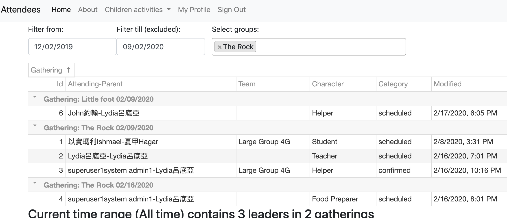

# Attendees
## An app for general event management
- Tracking who/when/where/what of any activities with attendance records.
- Monolith architecture based on dockers of [Python Django](https://github.com/pydanny/cookiecutter-django) and Javascript([DevExtreme](https://js.devexpress.com/Licensing/#NonCommercial)) on Postgres/PostGIS & Redis



## User stories

<details>
  <summary>Click to expand all meeting discussions</summary>

### Epic user
- As a user, I can login and use the app
- As an administrator, I can assign/update all users to different characters, such as teacher/helper/students, etc.
- As kid program organizer, I can create/update the groups of kid programs, such as "Shining Stars", etc.
- As kid program organizer, I can create/update lessons of kid programs for different quarter/dates, such as Rock@9/1/2019
- As a user, I can see groups and lesson public info of kid programs. (please define public info, such as time/location/stuff to bring/wear, etc)

### Epic parent
- As a parent, I can register/assign/change my kids (to lesson level?)
- As a parent, I can see my kids' lesson info, including dates/time/location(/leading teacher name?)
- As a parent never join kid programs before, given the passcode send to my cell#/email, I can register my kids.
- As a parent, given the passcode send to my cell#/email, I can login with parent's one cell#, zip-code and first name in English of my kids (even if they are twins).


### Epic coworker
- As teacher/coworker, I can see class rosters, which lists teachers/helpers/students/location/time of lessons
- As a teacher/coworker, I can add/change myself to lessons
- As a teacher/coworker, I can assign/change students to lessons
- As a teacher/coworker, I can text/paging parents (future)

### Epic developer
- As a developer of the app, I need to define flexible data structures storing kid programs, including user info and characters, groups, lessons.

### 20191024 meeting notes
- As a parent I can register kids for multiple programs/events.
- As a staff/organizer, I can add/copy kids to the programs/events next year without repeatedly keyin kids' data
- As a staff/organizer, I need to see kids grade, as kids grade may not reflecting their edge, and their grade needs auto-advance every year
- As a user, I can see languages depends on my browser settings (Chinese/English/Spanish, etc) (not in V1)
- As a staff/organizer, I need to see students' siblings relationship  (non real time processing is fine)
- As a non-parent registering kids, I have to enter kid parent info.
- As a coworker I need to register withOUT kids
- As a staff/organizer, when I click each session's class title, I will be linked to google drive for course materials.
- Last, probably redesign a non row-based listing for staff/organizer's day view or student roaster view (mobil phone friendly)

### 20200213 meeting notes
- As a parent I can be notified for the incoming classes, so that I can respond with RSVP or take absent for my kids.
- As a parent I can be notified to update contact info/address for my kids.
- As a coworker I can be notified for the incoming classes, so that I can respond with RSVP or take leave.
- As a organizer(coworkers?) I can be notified early when coworkers take leaves on the incoming class.
- As a organizer(coworkers?) I can assign students to different class, maybe or maybe not from student roaster.
- As a coworker I can take/retract the students attendance anytime in the class or check students attendance after classes.
- As a secretary I can receive all class attendance counts summary periodically.
- As a coworker, I can check or update BOTH age and grade of a student (age and grade of the same student may vary a lot).
- As a coworker, I can see both age and grade of a student (age and grade may vary a lot) periodically advanced automatically.
  
#### page priority 
- student roasters (with their medical concerns, parent contact, and possibly other attendances) for the incoming classes
- leader/coworker list for the incoming classes (for teacher availability and arrangement)

#### how to direct parents/coworker to use app (my own thoughts)
- Need to have some real data (secretary address database in MS Access)
- Initial registration by invite to parents/coworkers email/phone (combine with yearly contact update page)

</details>

## mockup
1. https://marvelapp.com/9dj5heb
2. https://marvelapp.com/prototype/876j52i

## data models
https://dbdiagram.io/d/5d5ff66eced98361d6dddc48

## [Deploy on Linux in production mode](https://cookiecutter-django.readthedocs.io/en/latest/deployment-with-docker.html)

<details>
  <summary>Click to expand all</summary>

* if other staging ran previously (such as local), please remove it like `docker-compose -f local.yml down -v`
* double check the domain name in `compose/production/traefik/traefik.yml` and `attendees/contrib/sites/migrations/0003_set_site_domain_and_name.py`
* setup env variables for django secret key:
```
export DJANGO_ALLOWED_HOSTS=("your.domain.name")
export DJANGO_SECRET_KEY=<<production Django secret key>>
```
* install docker and docker-compose, such as `sudo apt  install docker docker-compose`
* add web user to the docker group by `sudo usermod -aG docker <<web user name>>  && sudo service docker restart`
* Assuming git is available, git clone the repo by `git clone https://github.com/xjlin0/attendees30.git`
* create a production setting by `vi .envs/.production/.django` and save the following content.
```
# General
# ------------------------------------------------------------------------------
# DJANGO_READ_DOT_ENV_FILE=True
DJANGO_SETTINGS_MODULE=config.settings.production
DJANGO_SECRET_KEY=<<your django secret key>>
DJANGO_ADMIN_URL=<<any cryptic string as admin path>>
DJANGO_ALLOWED_HOSTS=<<your domain name>>
ENV_NAME=production
# Security
# ------------------------------------------------------------------------------
# TIP: better off using DNS, however, redirect is OK too
DJANGO_SECURE_SSL_REDIRECT=False
# SSL_CERT_DIR=/etc/ssl/certs
# SSL_CERT_FILE=/etc/ssl/certs/ca-certificates.crt
# Email
# ------------------------------------------------------------------------------
DJANGO_SERVER_EMAIL=

MAILGUN_API_KEY=
MAILGUN_DOMAIN=


# AWS
# ------------------------------------------------------------------------------
DJANGO_AWS_ACCESS_KEY_ID=
DJANGO_AWS_SECRET_ACCESS_KEY=
DJANGO_AWS_STORAGE_BUCKET_NAME=

# django-allauth
# ------------------------------------------------------------------------------
DJANGO_ACCOUNT_ALLOW_REGISTRATION=True

# Gunicorn
# ------------------------------------------------------------------------------
WEB_CONCURRENCY=4


# Redis
# ------------------------------------------------------------------------------
REDIS_URL=redis://redis:6379/0

# Celery
# ------------------------------------------------------------------------------

# Flower
CELERY_FLOWER_USER=<<YOUR CELERY_FLOWER_USER NAME>>
CELERY_FLOWER_PASSWORD=<<YOUR CELERY_FLOWER_PASSWORD>>

```
* create a production setting by `vi .envs/.production/.postgres` and save the following content.
```
# PostgreSQL
# ------------------------------------------------------------------------------
POSTGRES_HOST=postgres
POSTGRES_PORT=5432
POSTGRES_DB=attendees
POSTGRES_USER=<<production database user name>>
POSTGRES_PASSWORD=<<production database user password>>
```
* create a fake [sendgrid credential](https://docs.gravityforms.com/sendgrid-api-key/) files by `vi .envs/.local/sendgrid.env` and save the following fake content.
```
SENDGRID_API_KEY=FAKE
DJANGO_DEFAULT_FROM_EMAIL=fake@email.com
```
* build and start the production machine by `docker-compose -f production.yml build`
</details>

## [How to start dev env on Linux](https://cookiecutter-django.readthedocs.io/en/latest/developing-locally-docker.html)
* double check if the dev port 8008 is open on fire wall
* add server's public ip to ALLOWED_HOSTS in settings
* install docker and docker-compose, such as `sudo apt  install docker docker-compose`
* add web user to the docker group by `sudo usermod -aG docker <<web user name>>  && sudo service docker restart`
* Assuming git is available, git clone the repo by `git clone https://github.com/xjlin0/attendees30.git`
* create a fake [sendgrid credential](https://docs.gravityforms.com/sendgrid-api-key/) files by `vi .envs/.production/sendgrid.env` and save the following fake content.
```
SENDGRID_API_KEY=FAKE
DJANGO_DEFAULT_FROM_EMAIL=fake@email.com
```
* build and start the local machine by `docker-compose -f local.yml build && docker-compose -f local.yml up -d`
* Ensure the MailHog is not publicly available such as https://your.domain.name:8025
* Ensure the db password in .envs/.local/.postgres changed
* Ensure using a non-default ADMIN_URL
* upadte content types after migration by `docker-compose -f local.yml run django python manage.py update_content_types`
* create 2 superusers by `docker-compose -f local.yml run django python manage.py createsuperuser`
* import the seed data by `docker-compose -f local.yml run django python manage.py loaddata fixtures/db_seed`
* go to Django admin to add the first organization and all groups to the first user (superuser) at http://<<your domain name>>:8008/admin/users/user/

## [How to start dev env on Windows](https://cookiecutter-django.readthedocs.io/en/latest/developing-locally-docker.html)

All libraries are included to facilitate offline development, it will take port 8008, 8025, 5555 when running, please change port in local.yml if those ports are occupied.
* Install [git](https://git-scm.com/downloads) and [docker for windows](https://docs.docker.com/install), which includes docker-compose.
* clone the repo by `git clone git@github.com:xjlin0/attendees30.git` and cd the repo directory `attendees30`
* create a fake [sendgrid credential](https://docs.gravityforms.com/sendgrid-api-key/) files by `start notepad .envs/.local/sendgrid.env` and save the following fake content.
```
SENDGRID_API_KEY=FAKE
DJANGO_DEFAULT_FROM_EMAIL=fake@email.com
```
* build and start the local machine by `docker-compose -f local.yml build && docker-compose -f local.yml up -d`
* upadte content types after migration by `docker-compose -f local.yml run django python manage.py update_content_types`
* create 2 superusers by `docker-compose -f local.yml run --rm django python manage.py createsuperuser`
* import the seed data by `docker-compose -f local.yml run django python manage.py loaddata fixtures/db_seed`
* go to Django admin to add the first organization and all groups to the first user (superuser) at http://192.168.99.100:8008/admin/users/user/
```
192.168.99.100 is default ip, if your docker use a different IP and browser shows "DisallowedHost"
Please add your IP to ALLOWED_HOSTS in config/settings/local.py 
```
* use browser to open http://192.168.99.100:8008/ and http://192.168.99.100:8025/
* Enter postgres db console by `docker-compose -f local.yml exec postgres psql --username=YBIJMKerEaNYKqzfvMxOlBAesdyiahxk attendees_development`
* Enter Django console by `docker-compose -f local.yml run django python manage.py shell_plus`
* remote debug in PyCharm for docker, please check [django cookie doc](https://github.com/pydanny/cookiecutter-django/blob/master/{{cookiecutter.project_slug}}/docs/pycharm/configuration.rst).

## How to start dev env on MacOS

All libraries are included to facilitate offline development, it will take port 8008, 8025, 5555 when running, please change port in local.yml if those ports are occupied.
* clone the repo, for example, `git clone https://github.com/xjlin0/attendees.git`
* check local python version, Django coockie cutter is developed with Python 3
* There is no need to have local Django or Postgres running, but on MacOS you will need Virtualbox from https://www.virtualbox.org
* This is docker machine based CentOS, please install docker by `wget -qO- https://get.docker.com/ | sh && sudo usermod -aG docker centos`.
* Install docker compose by `sudo curl -L "https://github.com/docker/compose/releases/download/1.23.2/docker-compose-$(uname -s)-$(uname -m)" -o /usr/local/bin/docker-compose && sudo chmod +x /usr/local/bin/docker-compose`
* start the local docker machine by `sudo systemctl start docker`
* start a docker machine named "dev" by `docker-machine create --driver virtualbox dev`
* get all env variables from "dev" by `eval $(docker-machine env dev)`
* create a fake sendgrid credential files by `vi .envs/.local/sendgrid.env` and save the following fake content.
```
SENDGRID_API_KEY=FAKE
DJANGO_DEFAULT_FROM_EMAIL=fake@email.com
```
* build and start the local machine by `docker-compose -f local.yml build && docker-compose -f local.yml up -d`
* create migration files by `docker-compose -f local.yml run --rm django python manage.py makemigrations`
* migrate db by `docker-compose -f local.yml run --rm django python manage.py migrate`
* upadte content types after migration by `docker-compose -f local.yml run django python manage.py update_content_types`
* create 2 superusers by `docker-compose -f local.yml run --rm django python manage.py createsuperuser`
* import the seed data by `docker-compose -f local.yml run django python manage.py loaddata fixtures/db_seed`
  (data were created by `docker-compose -f local.yml run django python manage.py dumpdata --exclude users.user --exclude admin.logentry --exclude sessions.session --exclude contenttypes.contenttype --exclude sites.site --exclude account.emailaddress --exclude account.emailconfirmation --exclude socialaccount.socialtoken --exclude auth.permission --indent 2 > fixtures/db_seed2.json`)
* go to Django admin to add the first organization and all groups to the first user (superuser) at http://192.168.99.100:8008/admin/users/user/
* use browser to open http://192.168.99.100:8008/ and http://192.168.99.100:8025/
* Enter postgres db console by `docker-compose -f local.yml exec postgres psql --username=YBIJMKerEaNYKqzfvMxOlBAesdyiahxk attendees_development`
* Enter Django console by `docker-compose -f local.yml run django python manage.py shell_plus`
* remote debug in PyCharm for docker, please check [django cookie doc](https://github.com/pydanny/cookiecutter-django/blob/master/{{cookiecutter.project_slug}}/docs/pycharm/configuration.rst).

## DB SQL Backup & Restore process (with local.yml)
* backup current db to container `docker-compose -f local.yml exec postgres backup`
* list backup files in container `docker-compose -f local.yml exec postgres backups`
* copy all backup files from container to dev local computer `docker cp $(docker-compose -f local.yml ps -q postgres):/backups ./backups`
* copy all backup files from dev local computer to container `docker cp ./backups/* $(docker-compose -f local.yml ps -q postgres):/backups/`
* restore a backup from a backup file in container `docker-compose -f local.yml exec postgres restore backup_2018_03_13T09_05_07.sql.gz`

## Todo & progress:

<details>
  <summary>Click to expand all</summary>

- [x] make auth group not organization specific, and counselling note check on organization
- [ ] Past can replace Note on DB level, Attendee.progressions and calls/requests, so that any name lists such as status can be easily queried. (membership remains as attendance with category for active/inactive)
  - [x] make Past model generic
  - [ ] any past status list (Past level)
  - [ ] Attendance roaster to Past auto conversion
- [x] attendee detail page
  - [x] server side process of Attendees list & search page
  - [x] AttendingMeet form of Attendee update page
  - [x] [PR#3](https://github.com/xjlin0/attendees30/pull/3) FamilyAttendee datagrid of Attendee update page
  - [x] [PR#1](https://github.com/xjlin0/attendees30/pull/1) Move Address to Contact
  - [x] [PR#2](https://github.com/xjlin0/attendees30/pull/2) Personal & family Address of Attendee update page
  - [x] [PR#4](https://github.com/xjlin0/attendees30/pull/4) Dynamic contacts of Attendee update page
  - [x] [PR#9](https://github.com/xjlin0/attendees30/pull/9) Permission controlled blocks in single attendee update page, i.e. different blocks/user-settings for different groups
  - [x] [PR#11](https://github.com/xjlin0/attendees30/pull/11) Generic models such as Note, Place, Past need to have organization column instead of infos
  - [x] [PR#12](https://github.com/xjlin0/attendees30/pull/12) Add Past as Note
  - [x] [PR#13](https://github.com/xjlin0/attendees30/pull/13) [PR#14](https://github.com/xjlin0/attendees30/pull/14) [PR#15](https://github.com/xjlin0/attendees30/pull/15) Create new instance of Attendee & attending update page with params with meet
  - [x] [PR#16](https://github.com/xjlin0/attendees30/pull/16) delete function for human error
  - [x] [PR#5](https://github.com/xjlin0/attendees30/pull/5) Modify Attendee save method to combine/convert names by OpenCC to support searches in different text encoding, and retire db level full_name.
  - [x] [PR#8](https://github.com/xjlin0/attendees30/pull/8) implement secret/private relation/past general
  - [ ] some relationship may be internal and only shows to cowokers/admin, in category/boolean/infos column?
  - [ ] Rich format of note for Past on UI?
- [x] Move attendee/attendees page out of data assembly -- some coworkers need to see all attendees of the organization, with a way to see only family members for general users
  - [x] [PR#17](https://github.com/xjlin0/attendees30/pull/17) remove all previous attendee edit testing pages
  - [x] [PR#18](https://github.com/xjlin0/attendees30/pull/18) remove attendee list page dependency of path params and take search params from user for assembly slug
  - [x] [PR#19](https://github.com/xjlin0/attendees30/pull/19) rename and move attendees/attendee page, and show attendees based on auth groups
  - [x] [PR#26](https://github.com/xjlin0/attendees30/pull/26) make special Past as Meet to be shown in Attendees, also creating such Past will result in AttendingMeet creation
- [x] Gathering list (server side processing with auto-generation)
  - [x] [PR#20](https://github.com/xjlin0/attendees30/pull/20) gatherings datagrid filtered by meets and date ranges
  - [x] [PR#21](https://github.com/xjlin0/attendees30/pull/21) django-schedule with Meet
  - [x] [PR#22](https://github.com/xjlin0/attendees30/pull/22) can gathering generation automatic?
  - [x] [PR#23](https://github.com/xjlin0/attendees30/pull/23) sorting & grouping by server side processing
- [x] data [db backup/restore](https://cookiecutter-django.readthedocs.io/en/latest/docker-postgres-backups.html) to survive new releases and migrations
- [ ] Add Attendee+ buttons in above pages should deduplicate before creation by providing existing names for users to choose
  - [x] [PR#24](https://github.com/xjlin0/attendees30/pull/24) fix self attendee page error
  - [ ] from Attendee detail and attendee list page
- [ ] AttendingMeet list (server side processing)
  - [ ] new attendance datagrid filtered by meets and date ranges
  - [ ] auto-generation of AttendingMeet by django-schedule with certain Past
- [ ] Attendance list (server side processing with auto-generation)
  - [ ] new attendance datagrid filtered by meets and date ranges
  - [ ] auto-generation attendance by attending meet and recent attendance status
  - [ ] member list (attendance level with editing category)
- [ ] Create roaster page (no real-time update for multiple coworkers in v1)
  - [ ] Coworker roaster on phone/web, X: characters, Y: dates(gatherings)
- [ ] Division specific menu links, such as including selected meets in the search params
  - [ ] Junior
  - [ ] Data
- [ ] Audit log/history/vision of data
  - [ ] find library and install: django-pghistory maybe
  - [ ] each model level version
  - [ ] document aggregation level version
- [ ] upgrade to Django 3.1, 3.2LTS or 4, depends on Django Cookie-cutter's support of DEFAULT_AUTO_FIELD
   -[ ] 3.1: use Django JSONField instead of Postgres JSONField
   -[ ] With Django Cookie-cutter, decide async or not (uvicorn high CPU usage in Mac only, but web_socket can be only with use_async)
- [ ] deploy to AWS EC2
   - [x] [PR#25](https://github.com/xjlin0/attendees30/pull/25) ensure libraries loaded other than MacOS
- [ ] Export pdf
  - [ ] directory booklet
  - [ ] mail labels (avery template) or printing envelops
- [ ] i18n Translation on model data, django-parler maybe?

</details>

## Issues:

<details>
  <summary>Click to expand all</summary>

- [ ] for ordinary users:
   -[ ] even as scheduler seeing other's attendee detail view, the joined meet doesn't show group name (i.e. Hagar cannot see Ishmael in "the Rock")
</details>
